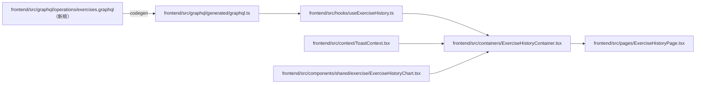

# 設計書 — 成長グラフ（フェーズ6）

Codex への実装依頼用ドキュメント。

---

## 1. 目的・ゴール

### 目的

種目ごとの重量・回数の推移を折れ線グラフで可視化し、ユーザーが成長を実感できるようにする。

### ユーザー価値

| 観点 | 期待する効果 |
|---|---|
| 成長実感 | 重量・回数が増えていることをグラフで確認できる |
| モチベーション | 過去の最高値を視覚的に把握できる |
| 振り返り | 停滞期や伸びた時期を把握できる |

### 完了ゴール

- `/exercises/:name` にアクセスすると、その種目の推移グラフが表示される
- 重量（kg）または回数の折れ線グラフを切り替えて表示できる
- データがない・重量なし（自重トレーニング）などの状態を適切に表示できる
- 既存の3層アーキテクチャを踏襲する

### スコープ

| 区分 | 内容 |
|---|---|
| 対象 | `ExerciseHistoryPage`（プレースホルダー）の実装、Hook・Container・Chart コンポーネントの追加 |
| 前提 | バックエンド API（`exerciseHistory`）は実装済み。ルート `/exercises/:name` は定義済み |
| 対象外 | 複数種目の比較、詳細ページからのリンク追加、`limit` 変更 UI |

---

## 2. 使用する GraphQL API

バックエンド実装済み。フロントの `.graphql` オペレーションファイルへの追記が必要。

### `exerciseHistory` Query

```graphql
query ExerciseHistory($exerciseName: String!, $limit: Int) {
  exerciseHistory(exerciseName: $exerciseName, limit: $limit) {
    date
    exerciseName
    weight
    reps
    durationSeconds
    sets
    bodyWeight
  }
}
```

- `limit` のデフォルト: 30（サーバー側。省略可）
- 返却順序: **日付の古い順**で返ってくる想定（グラフの X 軸左→右が時系列になる）
- `weight` / `reps` / `durationSeconds` はすべて nullable

---

## 3. アーキテクチャ（3層）

```
ExerciseHistoryPage (/exercises/:name)
  └── ExerciseHistoryContainer
        ├── useExerciseHistory フック（データ取得）
        └── ExerciseHistoryChart コンポーネント（Presentational）
```

### 層の責務

| 層 | ファイル | 責務 |
|---|---|---|
| Page | `pages/ExerciseHistoryPage.tsx` | 種目名の URL デコード・Container 配置 |
| Container | `containers/ExerciseHistoryContainer.tsx` | Hook 呼び出し・エラー Toast・グラフ切替状態管理 |
| Hook | `hooks/useExerciseHistory.ts` | `exerciseHistory` Query ラップ |
| Component | `components/shared/exercise/ExerciseHistoryChart.tsx` | グラフ表示（props のみ） |

---

## 4. 依存関係の全体図



---

## 5. Recharts の導入

チャートライブラリは未インストール。実装前に追加が必要。

```bash
cd frontend && npm install recharts
```

- バージョン: v2 系（React 18 対応）
- 使用コンポーネント: `LineChart`, `Line`, `XAxis`, `YAxis`, `CartesianGrid`, `Tooltip`, `ResponsiveContainer`
- Tailwind との共存: Recharts のスタイルは `style` prop / Recharts 組み込みプロパティで調整

---

## 6. グラフ切替仕様

### 切替対象

| モード | Y 軸の値 | 条件 |
|---|---|---|
| `weight` | `weight`（kg） | データに `weight !== null` が1件以上ある場合にタブを表示 |
| `reps` | `reps`（回） | データに `reps !== null` が1件以上ある場合にタブを表示 |

- 初期表示: `weight` データがあれば `weight`、なければ `reps`
- Y 軸の値が `null` のデータ点はグラフに表示しない（Recharts の `connectNulls={false}` で自然に欠落扱い）
- `durationSeconds`（時間ベース種目）は MVP1 対象外

### 切替状態の管理場所

`ExerciseHistoryContainer` で `useState<'weight' | 'reps'>` として管理する。

---

## 7. インターフェース定義

### `useExerciseHistory` の返却型

```ts
type ChartMode = 'weight' | 'reps';

interface ExerciseHistoryEntry {
  readonly date: string;           // YYYY-MM-DD
  readonly exerciseName: string;
  readonly weight: number | null;
  readonly reps: number | null;
  readonly durationSeconds: number | null;
  readonly sets: number;
  readonly bodyWeight: number | null;
}

interface UseExerciseHistoryResult {
  readonly entries: readonly ExerciseHistoryEntry[];
  readonly loading: boolean;
  readonly error: Error | undefined;
}

export function useExerciseHistory(
  exerciseName: string,
  limit?: number
): UseExerciseHistoryResult
```

### `ExerciseHistoryChart` の props

```ts
type ChartMode = 'weight' | 'reps';

interface ExerciseHistoryChartProps {
  readonly entries: readonly ExerciseHistoryEntry[];
  readonly mode: ChartMode;
  readonly onModeChange: (mode: ChartMode) => void;
  readonly hasWeightData: boolean;   // weight タブを表示するか
  readonly hasRepsData: boolean;     // reps タブを表示するか
  readonly loading: boolean;
  readonly error: Error | undefined;
}
```

---

## 8. 実装コード

この章は実装時の叩き台。`recharts` を追加し、`exercises.graphql` 作成後に `npm run codegen` を実行してから TypeScript 側を追加する。

### `frontend/src/graphql/operations/exercises.graphql`

```graphql
query ExerciseHistory($exerciseName: String!, $limit: Int) {
  exerciseHistory(exerciseName: $exerciseName, limit: $limit) {
    date
    exerciseName
    weight
    reps
    durationSeconds
    sets
    bodyWeight
  }
}
```

#### この実装で行っていること

| 処理 | 内容 |
|---|---|
| Query 名定義 | `ExerciseHistory` というフロント側の Operation 名を定義する |
| 変数定義 | `exerciseName` は必須、`limit` は任意として API に渡す |
| 取得項目指定 | グラフ描画と状態判定に必要な `date` / `weight` / `reps` / `durationSeconds` などを取得する |
| codegen の入力 | この `.graphql` を元に `ExerciseHistoryDocument` / `ExerciseHistoryQuery` が生成される |

このファイルは「どのデータが必要か」を宣言する場所。  
画面状態や表示ロジックは持たず、GraphQL API との契約だけを書く。

### `frontend/src/hooks/useExerciseHistory.ts`

```ts
import { ExerciseHistoryDocument } from '@/graphql/generated/graphql';
import type { ExerciseHistoryQuery } from '@/graphql/generated/graphql';
import { useQuery } from '@apollo/client';

type QueryExerciseHistoryEntry = ExerciseHistoryQuery['exerciseHistory'][number];

export type ChartMode = 'weight' | 'reps';

export interface ExerciseHistoryEntry {
  readonly date: string;
  readonly exerciseName: string;
  readonly weight: number | null;
  readonly reps: number | null;
  readonly durationSeconds: number | null;
  readonly sets: number;
  readonly bodyWeight: number | null;
}

export interface UseExerciseHistoryResult {
  readonly entries: readonly ExerciseHistoryEntry[];
  readonly loading: boolean;
  readonly error: Error | undefined;
}

const EMPTY_ENTRIES: readonly ExerciseHistoryEntry[] = [];

function toExerciseHistoryEntry(item: QueryExerciseHistoryEntry): ExerciseHistoryEntry {
  return {
    date: item.date,
    exerciseName: item.exerciseName,
    weight: item.weight ?? null,
    reps: item.reps ?? null,
    durationSeconds: item.durationSeconds ?? null,
    sets: item.sets,
    bodyWeight: item.bodyWeight ?? null,
  };
}

export function useExerciseHistory(
  exerciseName: string,
  limit?: number
): UseExerciseHistoryResult {
  const normalizedName = exerciseName.trim();
  const { data, loading, error } = useQuery(ExerciseHistoryDocument, {
    variables: { exerciseName: normalizedName, limit },
    skip: normalizedName.length === 0,
  });

  return {
    entries: data?.exerciseHistory.map(toExerciseHistoryEntry) ?? EMPTY_ENTRIES,
    loading,
    error: error ?? undefined,
  };
}
```

#### この実装で行っていること

| 処理 | 内容 |
|---|---|
| 生成型の利用 | `ExerciseHistoryQuery['exerciseHistory'][number]` から1件分の型を取り出す |
| UI 用型の定義 | `ExerciseHistoryEntry` として、Chart 側が使う形を明示する |
| 空配列の固定 | `EMPTY_ENTRIES` を使い、未取得時も `entries` を常に配列として返す |
| レスポンス整形 | `toExerciseHistoryEntry` で GraphQL レスポンスを UI 用データに変換する |
| nullable 整理 | `undefined` 寄りの値を `null` に揃え、表示側の分岐を単純にする |
| Query 実行 | `useQuery(ExerciseHistoryDocument)` で API から履歴を取得する |
| skip 制御 | 種目名が空の場合は API を呼ばない |

この Hook の役割は「API の都合を UI に漏らさないこと」。  
GraphQL の戻り値をそのまま Component に渡すのではなく、`entries` / `loading` / `error` の安定した形に整えて返す。

#### データ変換の流れ

```text
GraphQL response
  ↓
ExerciseHistoryQuery 型
  ↓
toExerciseHistoryEntry
  ↓
ExerciseHistoryEntry[]
  ↓
Container / Chart で利用
```

### `frontend/src/components/shared/exercise/ExerciseHistoryChart.tsx`

```tsx
import type { ChartMode, ExerciseHistoryEntry } from '@/hooks/useExerciseHistory';
import {
  CartesianGrid,
  Line,
  LineChart,
  ResponsiveContainer,
  Tooltip,
  XAxis,
  YAxis,
} from 'recharts';

export interface ExerciseHistoryChartProps {
  readonly entries: readonly ExerciseHistoryEntry[];
  readonly mode: ChartMode;
  readonly onModeChange: (mode: ChartMode) => void;
  readonly hasWeightData: boolean;
  readonly hasRepsData: boolean;
  readonly loading: boolean;
  readonly error: Error | undefined;
}

interface ChartPoint {
  readonly date: string;
  readonly weight: number | null;
  readonly reps: number | null;
}

function formatDateLabel(date: string): string {
  const parts = date.split('-');
  const month = parts[1] ?? '';
  const day = parts[2] ?? '';
  return `${month}/${day}`;
}

function toChartPoint(entry: ExerciseHistoryEntry): ChartPoint {
  return {
    date: entry.date,
    weight: entry.weight,
    reps: entry.reps,
  };
}

function getModeLabel(mode: ChartMode): string {
  return mode === 'weight' ? '重量(kg)' : '回数';
}

export function ExerciseHistoryChart(props: ExerciseHistoryChartProps): React.JSX.Element {
  if (props.loading) {
    return <p className="text-slate-600">読み込み中...</p>;
  }

  if (props.error !== undefined) {
    return <p className="text-slate-600">データを取得できませんでした。</p>;
  }

  if (props.entries.length === 0) {
    return <p className="text-slate-600">記録がありません</p>;
  }

  if (!props.hasWeightData && !props.hasRepsData) {
    return <p className="text-slate-600">グラフ表示できる重量・回数の記録がありません</p>;
  }

  const data = props.entries.map(toChartPoint);

  return (
    <section
      aria-labelledby="exercise-history-chart-heading"
      className="rounded-lg border border-slate-200 bg-white p-4"
    >
      <div className="flex flex-wrap items-center justify-between gap-3">
        <h2 id="exercise-history-chart-heading" className="text-lg font-semibold text-slate-900">
          成長グラフ
        </h2>
        <div className="flex rounded-md border border-slate-200 p-1" aria-label="表示指標">
          {props.hasWeightData ? (
            <button
              type="button"
              className={`rounded px-3 py-1 text-sm ${
                props.mode === 'weight' ? 'bg-slate-900 text-white' : 'text-slate-600'
              }`}
              onClick={() => props.onModeChange('weight')}
            >
              重量(kg)
            </button>
          ) : null}
          {props.hasRepsData ? (
            <button
              type="button"
              className={`rounded px-3 py-1 text-sm ${
                props.mode === 'reps' ? 'bg-slate-900 text-white' : 'text-slate-600'
              }`}
              onClick={() => props.onModeChange('reps')}
            >
              回数
            </button>
          ) : null}
        </div>
      </div>

      <p className="mt-3 text-sm text-slate-600">
        {getModeLabel(props.mode)} の推移を日付順に表示しています。
      </p>

      <div className="mt-4 h-72">
        <ResponsiveContainer width="100%" height="100%">
          <LineChart data={data} margin={{ top: 8, right: 16, bottom: 8, left: 0 }}>
            <CartesianGrid strokeDasharray="3 3" stroke="#e2e8f0" />
            <XAxis dataKey="date" tickFormatter={formatDateLabel} stroke="#64748b" />
            <YAxis stroke="#64748b" />
            <Tooltip labelFormatter={label => String(label)} />
            <Line
              type="monotone"
              dataKey={props.mode}
              name={getModeLabel(props.mode)}
              stroke="#10b981"
              strokeWidth={2}
              dot={{ r: 3 }}
              activeDot={{ r: 5 }}
              connectNulls={false}
            />
          </LineChart>
        </ResponsiveContainer>
      </div>
    </section>
  );
}
```

#### この実装で行っていること

| 処理 | 内容 |
|---|---|
| props 受け取り | Container から `entries` / `mode` / `loading` / `error` などを受け取る |
| 状態分岐 | loading、error、0件、グラフ不可状態を先に return する |
| 表示用データ作成 | `entries` を Recharts が使う `ChartPoint[]` に変換する |
| タブ表示 | `hasWeightData` / `hasRepsData` に応じて重量・回数ボタンを出し分ける |
| モード変更通知 | ボタン押下時に `onModeChange('weight' | 'reps')` を呼ぶ |
| 日付表示 | X 軸の日付を `YYYY-MM-DD` から `MM/DD` に整える |
| グラフ描画 | `LineChart` / `Line` で `weight` または `reps` の推移を描画する |
| 欠損値制御 | `connectNulls={false}` で null の点を無理につながない |

この Component の役割は「渡された props を表示すること」。  
GraphQL Query、Toast、URL パラメータ取得は持たない。グラフライブラリ Recharts を使うため、表示の責務はここに集約する。

#### 表示分岐の優先順位

```text
loading
  ↓ false
error
  ↓ undefined
entries.length === 0
  ↓ false
hasWeightData / hasRepsData が両方 false
  ↓ false
グラフ表示
```

#### タブとグラフの関係

| `mode` | 表示タブ | Recharts の `dataKey` | Y 軸の意味 |
|---|---|---|---|
| `weight` | 重量(kg) | `weight` | 重量の推移 |
| `reps` | 回数 | `reps` | 回数の推移 |

### `frontend/src/containers/ExerciseHistoryContainer.tsx`

```tsx
import { ExerciseHistoryChart } from '@/components/shared/exercise/ExerciseHistoryChart';
import { useToast } from '@/context/ToastContext';
import { useExerciseHistory } from '@/hooks/useExerciseHistory';
import type { ChartMode } from '@/hooks/useExerciseHistory';
import { useEffect, useState } from 'react';

export interface ExerciseHistoryContainerProps {
  readonly exerciseName: string;
}

const DEFAULT_HISTORY_LIMIT = 30;

function hasWeightData(entries: readonly { readonly weight: number | null }[]): boolean {
  return entries.some(entry => entry.weight !== null);
}

function hasRepsData(entries: readonly { readonly reps: number | null }[]): boolean {
  return entries.some(entry => entry.reps !== null);
}

export function ExerciseHistoryContainer(props: ExerciseHistoryContainerProps): React.JSX.Element {
  const { showToast } = useToast();
  const { entries, loading, error } = useExerciseHistory(
    props.exerciseName,
    DEFAULT_HISTORY_LIMIT
  );
  const [mode, setMode] = useState<ChartMode>('weight');

  const hasWeight = hasWeightData(entries);
  const hasReps = hasRepsData(entries);

  useEffect(() => {
    if (error !== undefined) {
      showToast(error.message, 'error');
    }
  }, [error, showToast]);

  useEffect(() => {
    if (loading) {
      return;
    }
    if (!hasWeight && !hasReps) {
      return;
    }
    if (mode === 'weight' && !hasWeight && hasReps) {
      setMode('reps');
      return;
    }
    if (mode === 'reps' && !hasReps && hasWeight) {
      setMode('weight');
      return;
    }
  }, [hasReps, hasWeight, loading, mode]);

  return (
    <ExerciseHistoryChart
      entries={entries}
      mode={mode}
      onModeChange={setMode}
      hasWeightData={hasWeight}
      hasRepsData={hasReps}
      loading={loading}
      error={error}
    />
  );
}
```

#### この実装で行っていること

| 処理 | 内容 |
|---|---|
| データ取得 Hook 呼び出し | `useExerciseHistory(props.exerciseName, DEFAULT_HISTORY_LIMIT)` で履歴を取得する |
| Toast 接続 | `error` が発生したら `showToast(error.message, 'error')` を呼ぶ |
| 表示モード管理 | `mode` を `useState<ChartMode>` で持つ |
| データ有無判定 | `hasWeightData` / `hasRepsData` でタブ表示可否を判定する |
| 非同期後の補正 | データ到着後、現在の `mode` に対応するデータがなければ別モードへ切り替える |
| props 渡し | Chart に必要な値をまとめて `ExerciseHistoryChart` へ渡す |

この Container の役割は「Hook と Component の橋渡し」。  
API 取得そのものは Hook、見た目は Chart に任せ、Container は画面状態と副作用を管理する。

#### なぜ `mode` 補正が必要か

初期値を `weight` にしているため、たとえば自重種目のように `weight` が全て `null` の場合、データ取得後も `mode = 'weight'` のままだと表示できる線がない。  
そのため、`entries` が届いた後に以下のように補正する。

```text
mode = weight かつ weight データなし かつ reps データあり
  → mode を reps に変更

mode = reps かつ reps データなし かつ weight データあり
  → mode を weight に変更
```

#### Container が持つもの・持たないもの

| 持つ | 持たない |
|---|---|
| `mode` の state | Recharts の JSX |
| Toast の副作用 | GraphQL の細かいレスポンス整形 |
| weight/reps の有無判定 | URL パラメータ取得 |
| Chart への props 組み立て | API Operation 定義 |

### `frontend/src/pages/ExerciseHistoryPage.tsx`

```tsx
import { ExerciseHistoryContainer } from '@/containers/ExerciseHistoryContainer';
import { useParams } from 'react-router-dom';

function decodeExerciseName(name: string | undefined): string {
  if (name === undefined) {
    return '';
  }

  try {
    return decodeURIComponent(name);
  } catch {
    return name;
  }
}

export function ExerciseHistoryPage(): React.JSX.Element {
  const { name } = useParams();
  const decoded = decodeExerciseName(name);

  return (
    <div>
      <h1 className="text-2xl font-semibold tracking-tight text-slate-900">
        {decoded.length > 0 ? `${decoded} の推移` : '種目の推移'}
      </h1>
      <div className="mt-6">
        <ExerciseHistoryContainer exerciseName={decoded} />
      </div>
    </div>
  );
}
```

#### この実装で行っていること

| 処理 | 内容 |
|---|---|
| URL パラメータ取得 | `useParams()` で `/exercises/:name` の `name` を取得する |
| URL デコード | `decodeExerciseName` で日本語種目名をデコードする |
| 例外対策 | 不正なエンコード文字列でも画面が落ちないよう `try/catch` する |
| 見出し表示 | 種目名があれば `{種目名} の推移`、なければ `種目の推移` を表示する |
| Container 配置 | デコード済みの種目名を `ExerciseHistoryContainer` に渡す |

この Page の役割は「ルート単位の入口」。  
URL から画面に必要な最初の値を取り出し、Container を配置する。データ取得やグラフ描画の詳細は持たない。

#### Page で止める責務

```text
/exercises/%E3%83%99%E3%83%B3%E3%83%81
  ↓
useParams()
  ↓
decodeURIComponent()
  ↓
ExerciseHistoryContainer exerciseName="ベンチ"
```

---

## 9. 追加・変更するファイル一覧

| パス | 新規/変更 | 内容 |
|---|---|---|
| `frontend/src/graphql/operations/exercises.graphql` | **新規** | `ExerciseHistory` クエリ定義 |
| `frontend/src/hooks/useExerciseHistory.ts` | **新規** | `exerciseHistory` Query フック |
| `frontend/src/components/shared/exercise/ExerciseHistoryChart.tsx` | **新規** | Recharts グラフ Presentational |
| `frontend/src/containers/ExerciseHistoryContainer.tsx` | **新規** | Hook・エラー Toast・切替状態 |
| `frontend/src/pages/ExerciseHistoryPage.tsx` | **変更** | プレースホルダー → Container 配置に差し替え |

---

## 10. 実装イメージ

### ExerciseHistoryPage（変更後）

```tsx
export function ExerciseHistoryPage(): React.JSX.Element {
  const { name } = useParams();
  const decoded = name !== undefined ? decodeURIComponent(name) : '';

  return (
    <div>
      <h1 className="text-2xl font-semibold tracking-tight text-slate-900">
        {decoded} の推移
      </h1>
      <div className="mt-6">
        <ExerciseHistoryContainer exerciseName={decoded} />
      </div>
    </div>
  );
}
```

### ExerciseHistoryContainer（疑似コード）

```tsx
export function ExerciseHistoryContainer(props: { exerciseName: string }): React.JSX.Element {
  const { showToast } = useToast();
  const { entries, loading, error } = useExerciseHistory(props.exerciseName);
  const [mode, setMode] = useState<'weight' | 'reps'>(
    entries.some((e) => e.weight !== null) ? 'weight' : 'reps'
  );

  useEffect(() => {
    if (error !== undefined) showToast(error.message, 'error');
  }, [error, showToast]);

  const hasWeightData = entries.some((e) => e.weight !== null);
  const hasRepsData = entries.some((e) => e.reps !== null);

  return (
    <ExerciseHistoryChart
      entries={entries}
      mode={mode}
      onModeChange={setMode}
      hasWeightData={hasWeightData}
      hasRepsData={hasRepsData}
      loading={loading}
      error={error}
    />
  );
}
```

### ExerciseHistoryChart の状態分岐

```tsx
if (props.loading) return <p className="text-slate-600">読み込み中...</p>;
if (props.error !== undefined) return <p className="text-slate-600">データを取得できませんでした。</p>;
if (props.entries.length === 0) return <p className="text-slate-600">記録がありません</p>;
// → グラフ表示
```

---

## 11. グラフ UI 仕様

### レイアウト

```
┌─────────────────────────────────────────────────────┐
│  [重量(kg)] [回数]  ← 切替タブ                       │
├─────────────────────────────────────────────────────┤
│                                                     │
│  100kg |              ●                             │
│        |          ●                                 │
│   80kg |      ●                                     │
│        |  ●                                         │
│        |____________________________________        │
│        1月  2月  3月  4月                           │
└─────────────────────────────────────────────────────┘
```

- X 軸: `date`（YYYY-MM-DD。表示は `MM/DD` 形式）
- Y 軸: `weight`（kg）または `reps`（回）
- ライン色: `#10b981`（emerald-500、既存バーと統一）
- タブは `hasWeightData` / `hasRepsData` が `false` の場合は非表示
- Recharts の `ResponsiveContainer` で幅を 100% に設定

---

## 12. 空状態・エラー方針

| 状態 | 表示 |
|---|---|
| ローディング中 | `読み込み中...`（既存パターンと統一） |
| エラー | `データを取得できませんでした。` + Toast（`StreakInfoContainer` と同パターン） |
| データ 0 件 | `記録がありません`（`ExerciseStatsCard` と同パターン） |
| weight が全 null（自重） | weight タブを非表示・reps タブのみ表示 |
| reps が全 null | reps タブを非表示・weight タブのみ表示 |

---

## 13. GraphQL codegen の再実行

`exercises.graphql` 追加後、codegen を実行して型を生成する。

```bash
cd frontend && npm run codegen
```

---

## 14. 動作確認内容

### コマンド確認

| コマンド | 目的 |
|---|---|
| `cd frontend && npm install recharts` | Recharts を依存関係に追加する |
| `cd frontend && npm run codegen` | `ExerciseHistoryDocument` / `ExerciseHistoryQuery` の生成確認 |
| `cd frontend && npm run build` | TypeScript・Vite ビルド確認 |

### ブラウザ確認

| 確認観点 | 期待結果 |
|---|---|
| `/exercises/ベンチプレス` にアクセス | ページ見出しが `ベンチプレス の推移` になり、グラフカードが表示される |
| weight データあり | `重量(kg)` タブが表示され、重量の折れ線が描画される |
| reps データあり | `回数` タブが表示され、クリックで回数の折れ線に切り替わる |
| weight が全 null | `重量(kg)` タブが表示されず、`回数` タブのみ表示される |
| reps が全 null | `回数` タブが表示されず、`重量(kg)` タブのみ表示される |
| データ 0 件 | `記録がありません` が表示される |
| API エラー | `データを取得できませんでした。` と Toast が表示される |
| モバイル幅 | グラフカードとタブが横にはみ出さず、グラフが幅 100% に収まる |

### データ観点

- X 軸が古い日付から新しい日付へ左から右に並んでいること
- `weight` / `reps` が `null` の点で線が不自然につながらないこと
- URL エンコードされた日本語種目名が正しくデコードされて API に渡ること
- 空の種目名では Query が skip され、不要な API 呼び出しが発生しないこと

---

## 15. 気をつけなければいけないこと

- `recharts` は現時点で未インストールのため、先に `npm install recharts` を行う
- `exercises.graphql` 追加後は必ず `npm run codegen` を実行し、生成型を更新してから TypeScript を実装する
- `useState` の初期値だけで `mode` を決めると、非同期データ取得後に `weight` / `reps` の有無と表示モードがズレる。`entries` 到着後に `useEffect` で補正する
- `durationSeconds` は API から返るが MVP1 ではグラフ対象外。時間ベース種目だけの場合は「グラフ表示できる重量・回数の記録がありません」を表示する
- `decodeURIComponent` は不正な URL エンコードで例外を投げるため、ページ側で `try/catch` しておく
- Recharts はアクセシビリティの代替表現が弱いため、少なくとも「何の指標を表示しているか」の説明文をグラフ近くに置く
- `ResponsiveContainer` の親要素には `h-72` など明示的な高さを指定する。高さがないとグラフが表示されない
- `connectNulls={false}` を指定し、欠損値を勝手につながない
- `any` / `as` / `enum` は使わない。生成型から `[number]` で要素型を取り出す
- `ExerciseHistoryChart` は props 表示に集中させ、GraphQL Query や Toast を持たせない
- 詳細ページから `/exercises/:name` へのリンク追加は別フェーズのため、この実装では範囲を広げない

---

## 16. スコープ外

- 詳細ページの種目名から `/exercises/:name` へのリンク追加（別フェーズで実施）
- 複数種目の比較表示
- `durationSeconds` ベース種目のグラフ
- `limit` の UI 変更
- タイマー機能（フェーズ7）

---

## 17. 参照ファイル（既存）

| ファイル | 参照目的 |
|---|---|
| `backend/src/graphql/schema.graphql` | `ExerciseHistory` 型の確認 |
| `frontend/src/graphql/operations/dashboard.graphql` | Query オペレーション定義の書き方 |
| `frontend/src/hooks/useTrainingSessionDetail.ts` | Query フック（`skip` 活用）の実装パターン |
| `frontend/src/containers/ExerciseStatsContainer.tsx` | Container の実装パターン（エラー Toast） |
| `frontend/src/pages/ExerciseHistoryPage.tsx` | 差し替え対象（`useParams` で `name` 取得済み） |
| `frontend/src/routes/index.tsx` | ルート定義確認（`/exercises/:name` 定義済み） |

---

## 18. 実装チェックリスト（Codex 完了基準）

- [ ] `recharts` を `npm install recharts` でインストール
- [ ] `frontend/src/graphql/operations/exercises.graphql` を新規作成し `ExerciseHistory` クエリを定義
- [ ] `npm run codegen` を実行して `graphql.ts` を再生成
- [ ] `useExerciseHistory.ts` を実装（`UseExerciseHistoryResult` 型を export）
- [ ] `ExerciseHistoryChart.tsx` を実装（Recharts 使用、ローディング・エラー・空状態を含む）
- [ ] `ExerciseHistoryContainer.tsx` を実装（切替 `useState`・エラー Toast 対応）
- [ ] `ExerciseHistoryPage.tsx` のプレースホルダーを Container 配置に差し替え
- [ ] weight 全 null 時に weight タブを非表示にする
- [ ] reps 全 null 時に reps タブを非表示にする
- [ ] entries が空配列のとき「記録がありません」を表示
- [ ] `durationSeconds` のみの種目でグラフ不可メッセージを表示
- [ ] `npm run build` が成功する
- [ ] `any` / `as` / `enum` を使用していないこと
- [ ] `interface` でオブジェクト型を定義していること
