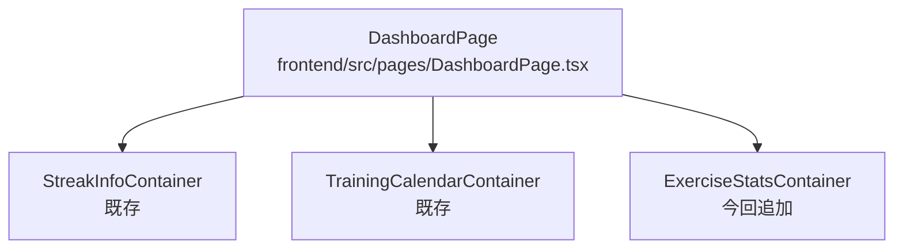
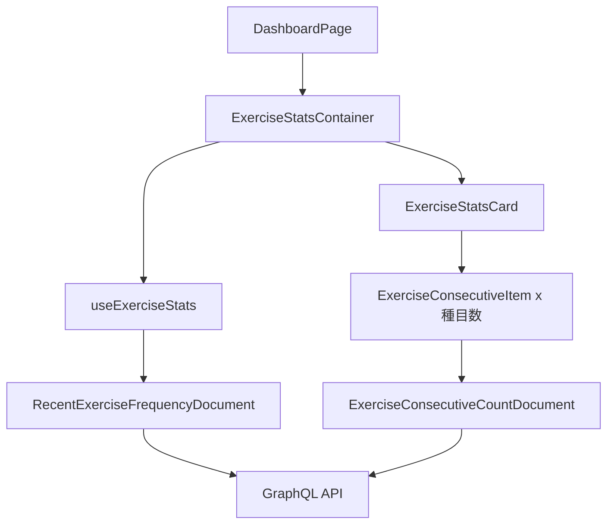
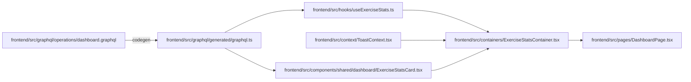

# 設計書 — 種目統計 UI（フェーズ5）

Codex への実装依頼用ドキュメント。

---

## 1. 目的・ゴール

### 目的

トレーニング記録のダッシュボード上で、最近よく実施している種目と、最新セッションから続いている種目の偏りを一目で把握できるようにする。  
これにより、ユーザーが「同じ種目に偏っていないか」「継続できている種目は何か」を判断し、次回のメニュー選びに活かせる状態を作る。

### ユーザー価値

| 観点 | 期待する効果 |
|---|---|
| マンネリ防止 | 直近5セッションで登場回数が多い種目を見て、偏りに気づける |
| 継続把握 | 最新セッションから何回連続で実施しているかを確認できる |
| 次回メニュー判断 | 「続ける種目」と「そろそろ入れ替える種目」を決めやすくする |

### 完了ゴール

- ダッシュボード（`/`）に、直近5セッションを対象にした種目統計カードが表示される
- 種目ごとに「直近5回中の登場セッション数」と「最新セッションからの連続実施回数」が確認できる
- 既存の `DashboardPage` / Container / Hook / Presentational の責務分離を崩さない
- ローディング・エラー・空状態が既存ダッシュボード UI と同じ温度感で扱われる

### スコープ

| 区分 | 内容 |
|---|---|
| 対象 | フロントエンドの GraphQL 接続、Hook、Container、Presentational UI、Dashboard への配置 |
| 前提 | バックエンド API は実装済み |
| 対象外 | 成長グラフ、種目別詳細ページへの導線強化、`sessionCount` 変更 UI、バックエンド改修 |

---

## 2. 概要

ダッシュボード（`/`）に **「直近の種目頻度」** と **「種目の連続実施回数」** を追加する。  
バックエンド API はすでに実装・動作確認済み。フロントエンドの Apollo 接続・UI 実装のみが対象。

### 表示内容

| セクション | 表示項目 |
|---|---|
| 直近の種目頻度 | 直近5セッションで実施した種目と登場セッション数（多い順） |
| 種目の連続実施回数 | 各種目が最新セッションから連続して登場しているセッション数 |

### 配置イメージ

```
DashboardPage (/)
  ├── StreakInfoContainer        （既存）
  ├── TrainingCalendarContainer  （既存）
  └── ExerciseStatsContainer     ← 今回追加
        ├── 直近の種目頻度カード
        └── 種目の連続実施回数カード
```

---

## 3. 依存関係の全体図

### 画面配置



### データ取得と UI の依存



### ファイル依存イメージ



---

## 4. 使用する GraphQL API

バックエンド実装済み。フロントの `.graphql` オペレーションファイルへの追記が必要。

### `recentExerciseFrequency` Query

```graphql
query RecentExerciseFrequency($sessionCount: Int) {
  recentExerciseFrequency(sessionCount: $sessionCount) {
    exerciseName
    count
  }
}
```

- `sessionCount`: デフォルト 5（省略可）
- 戻り値: `count` 降順・同数はひらがな/日本語名昇順でソート済み（サーバー側保証）

### `exerciseConsecutiveCount` Query

```graphql
query ExerciseConsecutiveCount($exerciseName: String!) {
  exerciseConsecutiveCount(exerciseName: $exerciseName)
}
```

- 最新セッションから遡り、この種目が連続して登場しているセッション数を返す
- 最新セッションにこの種目が含まれていない場合は `0` を返す

---

## 5. アーキテクチャ（3層）

```
DashboardPage
  └── ExerciseStatsContainer       ← useExerciseStats フック
        └── ExerciseStatsCard      ← Presentational
```

### 層の責務

| 層 | ファイル | 責務 |
|---|---|---|
| Page | `pages/DashboardPage.tsx` | Container を並べるだけ（既存に1行追加） |
| Container | `containers/ExerciseStatsContainer.tsx` | Hook 呼び出し・エラー処理 |
| Hook | `hooks/useExerciseStats.ts` | `recentExerciseFrequency` Query ラップ |
| Component | `components/shared/dashboard/ExerciseStatsCard.tsx` | 種目統計表示。カード本体は props 表示に集中 |

### `exerciseConsecutiveCount` の扱い

`exerciseConsecutiveCount` は種目名ごとに呼び出す必要があるため、**`recentExerciseFrequency` の結果を受け取った後に各種目名で並列クエリ**を発行する。  
実装上は `ExerciseStatsCard` 内で `ExerciseConsecutiveItem` コンポーネントを種目数分レンダリングし、各コンポーネント内で個別 Query を発行するパターンを採用する。  
この子コンポーネントは純粋な Presentational ではなく、行単位のデータ取得コンポーネントとして扱う。

```
ExerciseStatsContainer
  └── ExerciseStatsCard (props: frequencies)
        └── ExerciseConsecutiveItem × N   ← 各自 exerciseConsecutiveCount を呼ぶ
```

### 設計判断

| 判断 | 理由 |
|---|---|
| `recentExerciseFrequency` は専用 Hook に寄せる | 既存の `useStreakInfo` / `useTrainingDaysInMonth` と同じ Data Hook パターンに揃える |
| 連続回数は行コンポーネント単位で取得する | API が種目名単位のため。頻度リスト表示後に各行の連続回数だけ順次埋められる |
| 個別連続回数エラーでは Toast を出さない | 種目数分の通知が発生する可能性を避け、行内の `—` 表示に留める |
| `ExerciseConsecutiveItem` だけ Apollo を使う例外を許容する | 連続回数 API が行単位で、Container 側で Hooks の可変個呼び出しができないため |

---

## 6. 実装イメージ

### 実装ステップ

1. `frontend/src/graphql/operations/dashboard.graphql` に2つの Query を追加
2. `frontend` ディレクトリで `npm run codegen` を実行し、生成型と Document を更新
3. `useExerciseStats.ts` を作成し、`RecentExerciseFrequencyDocument` を `useQuery` でラップ
4. `ExerciseStatsCard.tsx` を作成し、頻度行・バー・連続回数表示を組み立てる
5. `ExerciseStatsContainer.tsx` を作成し、Hook 結果と Toast エラー処理を接続
6. `DashboardPage.tsx` に `<ExerciseStatsContainer />` を追加
7. 空状態・ローディング・エラー・連続回数 `0` の表示を確認

### 疑似コード

```tsx
// DashboardPage.tsx
<div className="mt-6 grid gap-6">
  <StreakInfoContainer />
  <TrainingCalendarContainer />
  <ExerciseStatsContainer />
</div>
```

```tsx
// ExerciseStatsContainer.tsx
const { showToast } = useToast();
const { frequencies, loading, error } = useExerciseStats(5);

useEffect(() => {
  if (error !== undefined) {
    showToast(error.message, 'error');
  }
}, [error, showToast]);

return <ExerciseStatsCard frequencies={frequencies} loading={loading} error={error} sessionCount={5} />;
```

```tsx
// ExerciseStatsCard.tsx
frequencies.map(item => (
  <ExerciseConsecutiveItem
    key={item.exerciseName}
    exerciseName={item.exerciseName}
    frequencyCount={item.count}
    sessionCount={sessionCount}
  />
));
```

---

## 7. インターフェース定義

### `useExerciseStats` の返却型

```ts
interface ExerciseFrequency {
  readonly exerciseName: string;
  readonly count: number;
}

interface UseExerciseStatsResult {
  readonly frequencies: readonly ExerciseFrequency[];
  readonly loading: boolean;
  readonly error: Error | undefined;
}

export function useExerciseStats(sessionCount?: number): UseExerciseStatsResult
```

### `ExerciseStatsCard` の props

```ts
interface ExerciseStatsCardProps {
  readonly frequencies: readonly ExerciseFrequency[];
  readonly loading: boolean;
  readonly error: Error | undefined;
  readonly sessionCount: number;
}
```

### `ExerciseConsecutiveItem` の props

```ts
interface ExerciseConsecutiveItemProps {
  readonly exerciseName: string;
  readonly frequencyCount: number;  // 頻度（recentExerciseFrequency の count）
  readonly sessionCount: number;    // バー表示の最大値
}
```

- `ExerciseConsecutiveItem` 内部で `exerciseConsecutiveCount` Query を発行し、連続回数を自律的に取得・表示する
- Apollo のキャッシュ（`cache-first`）が効くため、同一種目名への重複リクエストは発生しない

---

## 8. 作成ソースコード案

この章のコードは実装時の叩き台。`dashboard.graphql` 追記後に `npm run codegen` を実行し、`RecentExerciseFrequencyDocument` / `ExerciseConsecutiveCountDocument` が生成されてから TypeScript 側を追加する。

### `frontend/src/graphql/operations/dashboard.graphql`

既存の `StreakInfo` / `TrainingDaysInMonth` の下に追記する。

```graphql
query RecentExerciseFrequency($sessionCount: Int) {
  recentExerciseFrequency(sessionCount: $sessionCount) {
    exerciseName
    count
  }
}

query ExerciseConsecutiveCount($exerciseName: String!) {
  exerciseConsecutiveCount(exerciseName: $exerciseName)
}
```

### `frontend/src/hooks/useExerciseStats.ts`

```ts
import {
  RecentExerciseFrequencyDocument,
  RecentExerciseFrequencyQuery,
} from '@/graphql/generated/graphql';
import { useQuery } from '@apollo/client';

type QueryExerciseFrequency = RecentExerciseFrequencyQuery['recentExerciseFrequency'][number];

export interface ExerciseFrequency {
  readonly exerciseName: string;
  readonly count: number;
}

export interface UseExerciseStatsResult {
  readonly frequencies: readonly ExerciseFrequency[];
  readonly loading: boolean;
  readonly error: Error | undefined;
}

const EMPTY_FREQUENCIES: readonly ExerciseFrequency[] = [];

function toExerciseFrequency(item: QueryExerciseFrequency): ExerciseFrequency {
  return {
    exerciseName: item.exerciseName,
    count: item.count,
  };
}

export function useExerciseStats(sessionCount?: number): UseExerciseStatsResult {
  const { data, loading, error } = useQuery(RecentExerciseFrequencyDocument, {
    variables: { sessionCount },
  });

  return {
    frequencies: data?.recentExerciseFrequency.map(toExerciseFrequency) ?? EMPTY_FREQUENCIES,
    loading,
    error: error ?? undefined,
  };
}
```

### `frontend/src/components/shared/dashboard/ExerciseStatsCard.tsx`

```tsx
import { ExerciseConsecutiveCountDocument } from '@/graphql/generated/graphql';
import { useQuery } from '@apollo/client';

interface ExerciseFrequency {
  readonly exerciseName: string;
  readonly count: number;
}

export interface ExerciseStatsCardProps {
  readonly frequencies: readonly ExerciseFrequency[];
  readonly loading: boolean;
  readonly error: Error | undefined;
  readonly sessionCount: number;
}

interface ExerciseConsecutiveItemProps {
  readonly exerciseName: string;
  readonly frequencyCount: number;
  readonly sessionCount: number;
}

function ExerciseConsecutiveItem(props: ExerciseConsecutiveItemProps): React.JSX.Element {
  const { data, loading, error } = useQuery(ExerciseConsecutiveCountDocument, {
    variables: { exerciseName: props.exerciseName },
  });

  const consecutiveCount = data?.exerciseConsecutiveCount ?? 0;
  const barPercent =
    props.sessionCount > 0 ? Math.min(100, (props.frequencyCount / props.sessionCount) * 100) : 0;
  const shouldShowConsecutive = !loading && error === undefined && consecutiveCount > 0;

  return (
    <li className="grid gap-2 border-t border-slate-100 py-3 first:border-t-0 sm:grid-cols-[minmax(0,1fr)_minmax(120px,180px)_4rem_5rem] sm:items-center">
      <span className="font-medium text-slate-900">{props.exerciseName}</span>
      <span className="h-2 rounded-full bg-slate-100" aria-hidden="true">
        <span
          className="block h-2 rounded-full bg-emerald-500"
          style={{ width: `${barPercent}%` }}
        />
      </span>
      <span className="text-sm text-slate-600">{props.frequencyCount}回</span>
      <span className="text-sm font-medium text-slate-700">
        {loading || error !== undefined ? '—' : null}
        {shouldShowConsecutive ? `${consecutiveCount}回連続` : null}
      </span>
    </li>
  );
}

export function ExerciseStatsCard(props: ExerciseStatsCardProps): React.JSX.Element {
  if (props.loading) {
    return <p className="text-slate-600">読み込み中...</p>;
  }

  if (props.error !== undefined) {
    return <p className="text-slate-600">データを取得できませんでした。</p>;
  }

  return (
    <section
      aria-labelledby="exercise-stats-heading"
      className="rounded-lg border border-slate-200 bg-white p-4"
    >
      <h2 id="exercise-stats-heading" className="text-lg font-semibold text-slate-900">
        直近{props.sessionCount}回の種目傾向
      </h2>

      {props.frequencies.length === 0 ? (
        <p className="mt-4 text-sm text-slate-600">記録がありません</p>
      ) : (
        <ul className="mt-4">
          {props.frequencies.map(item => (
            <ExerciseConsecutiveItem
              key={item.exerciseName}
              exerciseName={item.exerciseName}
              frequencyCount={item.count}
              sessionCount={props.sessionCount}
            />
          ))}
        </ul>
      )}
    </section>
  );
}
```

### `frontend/src/containers/ExerciseStatsContainer.tsx`

```tsx
import { ExerciseStatsCard } from '@/components/shared/dashboard/ExerciseStatsCard';
import { useToast } from '@/context/ToastContext';
import { useExerciseStats } from '@/hooks/useExerciseStats';
import { useEffect } from 'react';

const DEFAULT_SESSION_COUNT = 5;

export function ExerciseStatsContainer(): React.JSX.Element {
  const { showToast } = useToast();
  const { frequencies, loading, error } = useExerciseStats(DEFAULT_SESSION_COUNT);

  useEffect(() => {
    if (error !== undefined) {
      showToast(error.message, 'error');
    }
  }, [error, showToast]);

  return (
    <ExerciseStatsCard
      frequencies={frequencies}
      loading={loading}
      error={error}
      sessionCount={DEFAULT_SESSION_COUNT}
    />
  );
}
```

### `frontend/src/pages/DashboardPage.tsx`

```tsx
import { ExerciseStatsContainer } from '@/containers/ExerciseStatsContainer';
import { StreakInfoContainer } from '@/containers/StreakInfoContainer';
import { TrainingCalendarContainer } from '@/containers/TrainingCalendarContainer';

export function DashboardPage(): React.JSX.Element {
  return (
    <div>
      <h1 className="text-2xl font-semibold tracking-tight text-slate-900">ダッシュボード</h1>
      <div className="mt-6 grid gap-6">
        <StreakInfoContainer />
        <TrainingCalendarContainer />
        <ExerciseStatsContainer />
      </div>
    </div>
  );
}
```

---

## 9. 追加・変更するファイル一覧

| パス | 新規/変更 | 内容 |
|---|---|---|
| `frontend/src/graphql/operations/dashboard.graphql` | **変更** | `RecentExerciseFrequency` / `ExerciseConsecutiveCount` クエリを追記 |
| `frontend/src/hooks/useExerciseStats.ts` | **新規** | `recentExerciseFrequency` Query フック |
| `frontend/src/components/shared/dashboard/ExerciseStatsCard.tsx` | **新規** | 種目統計表示カード（`ExerciseConsecutiveItem` を内包） |
| `frontend/src/containers/ExerciseStatsContainer.tsx` | **新規** | `useExerciseStats` 呼び出し・エラー処理 |
| `frontend/src/pages/DashboardPage.tsx` | **変更** | `<ExerciseStatsContainer />` を末尾に追加 |

---

## 10. UI 表示仕様

### ExerciseStatsCard の表示レイアウト

```
┌─────────────────────────────────────────────────────┐
│ 直近5回の種目傾向                                     │
├─────────────────────────────────────────────────────┤
│  ベンチプレス      ■■■■■  3回  🔥 3回連続            │
│  スクワット        ■■■    2回  🔥 2回連続            │
│  デッドリフト      ■      1回  　 (最新には未実施)    │
└─────────────────────────────────────────────────────┘
```

- 種目名・頻度バー（`sessionCount` を最大値とした相対幅）・登場セッション数・連続回数を1行で表示
- 連続回数が `0` の場合は連続表示を省略（最新セッションで実施していない）
- ローディング中は各行をスケルトン表示（既存の `StreakInfoCard` の `loading` パターンと同様）
- `frequencies` が空配列のときは「記録がありません」と表示

### 推奨レイアウト方針

| 要素 | 表示方針 |
|---|---|
| カード | 既存 `StreakInfoCard` / `TrainingCalendar` と同じ `section` + `h2` 構成 |
| 見出し | `直近5回の種目傾向`。`sessionCount` を変数化する場合は表示文言も追従 |
| 種目名 | 1行表示。長い場合は折り返しまたは `truncate` を検討 |
| 頻度バー | `frequencyCount / sessionCount * 100` を幅にする。最大幅でもレイアウトが崩れない固定トラックに置く |
| 登場回数 | `3回` のように短く表示 |
| 連続回数 | `3回連続`。`0` の場合は非表示、ローディングまたはエラー時は `—` |
| 空状態 | `記録がありません` をカード内に表示。次アクション文言は MVP では任意 |

### レスポンシブイメージ

| 画面幅 | 方針 |
|---|---|
| mobile | 種目名、バー、回数を縦に詰めすぎず、1種目を1行または2行で表示 |
| desktop | 種目名 / バー / 登場回数 / 連続回数を横並びにし、一覧としてスキャンしやすくする |

### ExerciseConsecutiveItem のローディング

- 連続回数のみ個別に取得するため、頻度リストが表示された後に連続回数が順次埋まる挙動を許容
- 連続回数ローディング中は `—` を表示

---

## 11. 状態別表示

| 状態 | 表示 | Toast |
|---|---|---|
| 初回ローディング | カード領域に `読み込み中...` またはスケルトン | なし |
| 頻度取得エラー | `データを取得できませんでした。` | あり |
| 頻度0件 | `記録がありません` | なし |
| 頻度取得成功・連続回数ローディング | 頻度行を表示し、連続回数だけ `—` | なし |
| 連続回数取得エラー | 対象行の連続回数だけ `—` | なし |
| 連続回数0 | 連続回数表示を省略 | なし |
| 連続回数1以上 | `N回連続` を表示 | なし |

---

## 12. GraphQL codegen の再実行

`dashboard.graphql` 変更後、codegen を実行して型を再生成する。

```bash
cd frontend && npm run codegen
```

---

## 13. エラー・ローディング方針

- `recentExerciseFrequency` のエラー: `useEffect` で `showToast(error.message, 'error')`（既存 Container と同パターン）
- `exerciseConsecutiveCount` の個別エラー: 連続回数の表示を `—` にとどめ Toast は出さない（UX 過剰通知の防止）
- `ExerciseStatsContainer` と他 Container は独立しているため、エラーが波及しない

---

## 14. 実装時の注意点

- `DashboardPage` は Container を並べるだけに留める
- `ExerciseStatsContainer` は `showToast` と Hook 接続に集中させ、表示ロジックを持ちすぎない
- `useExerciseStats` は `data?.recentExerciseFrequency ?? []` のように、未取得時の戻り値を空配列に揃える
- `ExerciseStatsCard` 本体は props 表示を中心にする
- `ExerciseConsecutiveItem` は `ExerciseStatsCard.tsx` 内の内部コンポーネントとして置いてよい。ただし Apollo Query を持つため、責務は「行単位のデータ取得 + 表示」と明記する
- `frequencyCount` は「セット数」ではなく「その種目が登場したセッション数」
- 1セッション内に同一種目が複数行あっても、バックエンドはセッション単位で1回として数える想定
- `sessionCount` は当面 `5` 固定。将来変更 UI を入れる場合に備えて props で渡せる形にする
- `any` / `as` / `enum` は使わない

---

## 15. スコープ外

- 成長グラフ（`exerciseHistory`） → フェーズ6
- タイマー機能 → フェーズ7
- `sessionCount` を UI 上で変更できる設定 → MVP1 外

---

## 16. 参照ファイル（既存）

| ファイル | 参照目的 |
|---|---|
| `backend/src/graphql/schema.graphql` | `ExerciseFrequency` 型・Query 引数の確認 |
| `frontend/src/graphql/operations/dashboard.graphql` | 既存 Query オペレーション定義の書き方 |
| `frontend/src/hooks/useStreakInfo.ts` | Query フックの実装パターン |
| `frontend/src/containers/StreakInfoContainer.tsx` | Container の実装パターン（エラー Toast） |
| `frontend/src/components/shared/dashboard/StreakInfoCard.tsx` | ローディング・エラー・表示パターン |
| `frontend/src/pages/DashboardPage.tsx` | Container の追加箇所 |
| `frontend/src/graphql/generated/graphql.ts` | `ExerciseFrequency` 型・既存生成型の確認 |

---

## 17. 実装チェックリスト（完了基準）

- [ ] `dashboard.graphql` に `RecentExerciseFrequency` / `ExerciseConsecutiveCount` オペレーションを追記
- [ ] `npm run codegen` を実行して `graphql.ts` を再生成
- [ ] `useExerciseStats.ts` を実装（`UseExerciseStatsResult` 型を export）
- [ ] `ExerciseStatsCard.tsx` を実装（`ExerciseConsecutiveItem` を内包）
- [ ] `ExerciseStatsContainer.tsx` を実装（エラー Toast 対応）
- [ ] `DashboardPage.tsx` に `<ExerciseStatsContainer />` を追加
- [ ] `frequencies` が空のとき「記録がありません」を表示
- [ ] 連続回数 `0` のとき連続表示を省略
- [ ] `any` / `as` / `enum` を使用していないこと
- [ ] `interface` でオブジェクト型を定義していること

---

## 18. 受け入れ条件

- ダッシュボード表示時に `recentExerciseFrequency(sessionCount: 5)` が呼ばれる
- 頻度取得後、表示対象の各種目について `exerciseConsecutiveCount(exerciseName)` が呼ばれる
- 頻度リストは API の順序を尊重して表示される
- 連続回数が `0` の種目では `N回連続` が表示されない
- 頻度取得エラー時、画面上のエラー表示と Toast が出る
- 個別の連続回数取得エラーでは Toast が出ない
- 記録が存在しない場合、カード内に空状態が表示される
- 既存のストリークカード、カレンダー表示に影響しない
