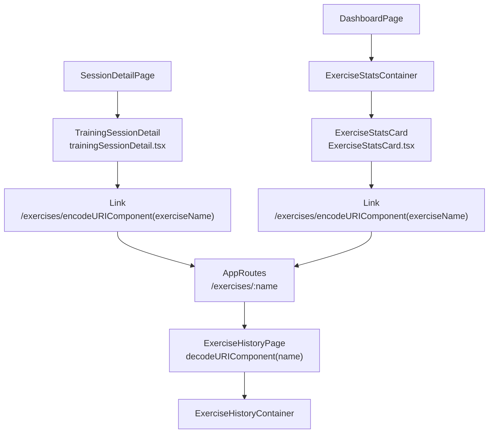

# 実装ドキュメント — 成長グラフへの導線追加

`docs/DESIGN_EXERCISE_HISTORY_LINK.md` をもとに、実装者がそのまま作業できる粒度で整理した手順書。

---

## 1. 目的

実装済みの成長グラフページ `/exercises/:name` へ、既存画面から自然に遷移できる導線を追加する。

現状はページとルートが存在していても、ユーザーが画面上の種目名から成長グラフへ移動できない。トレーニング詳細ページとダッシュボードの種目統計カードにリンクを追加し、記録確認から成長推移確認までの動線をつなげる。

---

## 2. ゴール

- トレーニング詳細ページの種目名をクリックすると `/exercises/:name` へ遷移する
- ダッシュボードの種目統計カードの種目名をクリックすると `/exercises/:name` へ遷移する
- 種目名は `encodeURIComponent` で URL エンコードする
- 日本語種目名でも `ExerciseHistoryPage` 側で正しく復元される
- 新規コンポーネント、Hook、GraphQL API、ルートは追加しない
- `any` / `as` / `enum` を使わない

---

## 3. 推奨アーキテクチャ

### 構成図



### コンポーネント / レイヤの説明

| 名前 | パス | 責務 | 依存 |
|---|---|---|---|
| `TrainingSessionDetail` | `frontend/src/components/shared/training/trainingSessionDetail.tsx` | セッション詳細内の種目一覧を表示し、種目名を成長グラフへのリンクにする | `react-router-dom` の `Link`。Apollo は直接呼ばない |
| `ExerciseStatsCard` | `frontend/src/components/shared/dashboard/ExerciseStatsCard.tsx` | ダッシュボードの種目統計を表示し、各種目名を成長グラフへのリンクにする | `Link` と `useQuery`。既存の `ExerciseConsecutiveItem` 内で Apollo を使用 |
| `AppRoutes` | `frontend/src/routes/index.tsx` | `/exercises/:name` を `ExerciseHistoryPage` に接続する | 既存定義を利用。変更不要 |
| `ExerciseHistoryPage` | `frontend/src/pages/ExerciseHistoryPage.tsx` | URL パラメータの `name` を `decodeURIComponent` で復元し、Container に渡す | 既存実装を利用。変更不要 |

### 状態分岐

今回の変更はリンク化のみで、既存の loading / error / empty / data の分岐順序は変更しない。

- `TrainingSessionDetail`: 既存のセッション詳細表示を維持し、種目名表示だけを `span` から `Link` に差し替える
- `ExerciseStatsCard`: 既存の `props.loading` → `props.error` → `props.frequencies.length === 0` → 一覧表示の順序を維持する

---

## 4. 全体の実施タスク

1. `trainingSessionDetail.tsx` の種目名表示を `Link` に変更する
2. `ExerciseStatsCard.tsx` に `Link` import を追加する
3. `ExerciseStatsCard.tsx` の `ExerciseConsecutiveItem` 内の種目名表示を `Link` に変更する
4. どちらの遷移先も `/exercises/${encodeURIComponent(exerciseName)}` に統一する
5. TypeScript / lint / 手動遷移確認を行う

---

## 5. 各タスクでやること

### タスク1: トレーニング詳細の種目名をリンク化する

**パス**

`frontend/src/components/shared/training/trainingSessionDetail.tsx`

**実装コードテンプレート**

変更前:

```tsx
<span className="font-medium text-slate-900">{ex.exerciseName}</span>
```

変更後:

```tsx
<Link
  to={`/exercises/${encodeURIComponent(ex.exerciseName)}`}
  className="font-medium text-slate-900 underline hover:text-emerald-700"
>
  {ex.exerciseName}
</Link>
```

**気をつけるべきポイント**

- このファイルでは既に `Link` を `react-router-dom` から import しているため、import 追加は不要
- 既存の編集リンクやセット数表示の構造は変えない
- `ex.exerciseName` をそのまま URL に入れず、必ず `encodeURIComponent` を通す
- `className` は既存の `font-medium text-slate-900` を維持し、リンクと分かるように `underline hover:text-emerald-700` を追加する

**業務で役立つポイント**

URL パラメータに日本語やスペースが入る場合、リンク生成側で encode、受け取り側で decode する形にしておくと、ブラウザ・ルーター・直接 URL 入力の差分に強くなる。

### タスク2: 種目統計カードに `Link` import を追加する

**パス**

`frontend/src/components/shared/dashboard/ExerciseStatsCard.tsx`

**実装コードテンプレート**

```ts
import { Link } from 'react-router-dom';
```

配置例:

```ts
import { ExerciseConsecutiveCountDocument } from '@/graphql/generated/graphql';
import type { ExerciseFrequency } from '@/hooks/useExerciseStats';
import { useQuery } from '@apollo/client';
import { Link } from 'react-router-dom';
```

**気をつけるべきポイント**

- `Link` は値として JSX で使うため `import type` にはしない
- 既存の `ExerciseConsecutiveCountDocument` と `useQuery` の import はそのまま残す
- import 順序で lint がある場合は、プロジェクトの自動整形結果に従う

### タスク3: 種目統計カードの種目名をリンク化する

**パス**

`frontend/src/components/shared/dashboard/ExerciseStatsCard.tsx`

**実装コードテンプレート**

変更対象は `ExerciseConsecutiveItem` の return 内。

変更前:

```tsx
<span className="font-medium text-slate-900">{props.exerciseName}</span>
```

変更後:

```tsx
<Link
  to={`/exercises/${encodeURIComponent(props.exerciseName)}`}
  className="font-medium text-slate-900 underline hover:text-emerald-700"
>
  {props.exerciseName}
</Link>
```

**気をつけるべきポイント**

- `ExerciseStatsCard` 全体ではなく、行単位の `ExerciseConsecutiveItem` 内を変更する
- `props.exerciseName` を使い、頻度バーや連続回数の表示ロジックは触らない
- `aria-label` や `progressbar` の属性は既存のまま維持する
- `formatConsecutive` や Apollo Query の挙動は今回のスコープ外

**業務で役立つポイント**

一覧の行全体をリンクにすると、バーや数値部分とのクリック範囲・アクセシビリティ設計が増える。今回は設計書どおり種目名だけをリンクにして、変更範囲を最小化する。

### タスク4: URL 生成ルールを統一する

**パス**

- `frontend/src/components/shared/training/trainingSessionDetail.tsx`
- `frontend/src/components/shared/dashboard/ExerciseStatsCard.tsx`

**実装コードテンプレート**

```ts
`/exercises/${encodeURIComponent(exerciseName)}`
```

使用箇所別:

```tsx
to={`/exercises/${encodeURIComponent(ex.exerciseName)}`}
```

```tsx
to={`/exercises/${encodeURIComponent(props.exerciseName)}`}
```

**気をつけるべきポイント**

- `/exercises/${exerciseName}` のように生文字列を直接連結しない
- `ExerciseHistoryPage` では `decodeURIComponent(name)` 済みなので、リンク元では encode だけを担当する
- `encodeURI` ではなく `encodeURIComponent` を使う。パスセグメントとして種目名全体を扱うため

---

## 6. 動作確認リスト

| 確認 | 手順 | 期待結果 |
|---|---|---|
| TypeScript | `cd frontend && npm run typecheck` | 型エラーがない |
| lint | `cd frontend && npm run lint` | lint エラーがない |
| トレーニング詳細からの遷移 | `/sessions/:id` を開き、種目名をクリック | `/exercises/:name` に遷移し、該当種目の推移画面が表示される |
| ダッシュボードからの遷移 | `/` を開き、種目統計カード内の種目名をクリック | `/exercises/:name` に遷移し、該当種目の推移画面が表示される |
| 日本語種目名 | `ベンチプレス` など日本語の種目名をクリック | URL はエンコードされ、画面見出しでは `ベンチプレスの推移` と表示される |
| 空状態 | 種目統計が空の状態で `/` を表示 | 既存どおり `記録がありません` が表示され、余計なリンクは出ない |
| 既存 UI | 詳細ページの編集リンク、セット数、回数、秒、重量表示を確認 | 今回変更前と同じ情報が表示される |

---

## 7. 次の Action

1. `trainingSessionDetail.tsx` と `ExerciseStatsCard.tsx` の種目名 `span` を `Link` に差し替える
2. `ExerciseStatsCard.tsx` に `Link` import を追加する
3. `cd frontend && npm run typecheck`、必要に応じて `cd frontend && npm run lint` を実行する
4. ブラウザで詳細ページとダッシュボードの両方から `/exercises/:name` へ遷移できることを確認する
