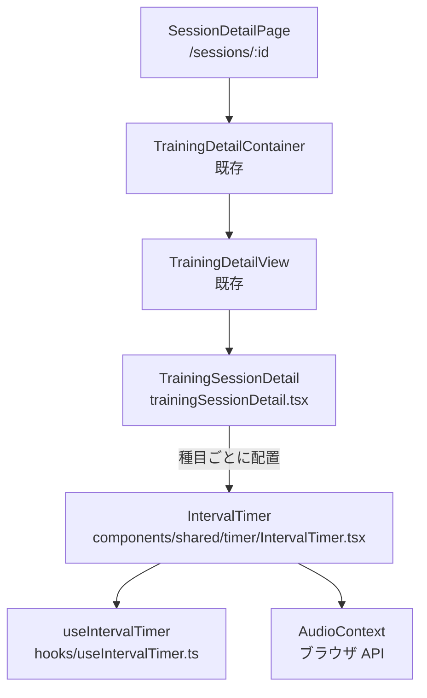

# 実装ドキュメント — インターバルタイマー機能（フェーズ7）

`docs/DESIGN_TIMER.md` をもとに、実装者がそのまま作業できる粒度で整理した手順書。

---

## 1. 目的

トレーニング詳細ページの各種目行で、セット間の休憩時間をカウントダウン管理できるようにする。

バックエンド連携や保存処理は行わず、フロントエンド内の一時状態だけで完結させる。ユーザーは種目ごとに独立したタイマーを開き、開始・一時停止・再開・リセットを操作できる。カウントが 0 秒になったらブラウザ上でビープ音を鳴らす。

---

## 2. ゴール

- `/sessions/:id` のトレーニング詳細ページで各種目にタイマー UI が表示される
- タイマーは `<details>` で折りたたみ可能
- 初期値は 90 秒
- ユーザーが idle 状態で秒数を変更できる
- 開始 / 一時停止 / 再開 / リセットが状態に応じて操作できる
- カウントダウン中は 1 秒ごとに残り時間が減る
- 残り時間は `MM:SS` 形式で表示する
- 残り 10 秒以内は赤色で表示する
- 0 秒到達時にビープ音を鳴らし、初期値へ戻って idle 状態になる
- GraphQL API、バックエンド、DB、ルーティングは変更しない
- `any` / `as` / `enum` を使わない
- オブジェクト型は `interface` で定義する

---

## 3. 推奨アーキテクチャ

### 構成図



### レイヤの説明

| 名前 | パス | 責務 | 依存 |
|---|---|---|---|
| `useIntervalTimer` | `frontend/src/hooks/useIntervalTimer.ts` | タイマー状態、カウントダウン、開始/停止/リセット操作を管理する | React hooks のみ |
| `IntervalTimer` | `frontend/src/components/shared/timer/IntervalTimer.tsx` | 入力、残り時間、操作ボタン、音アラートを持つ自己完結 UI | `useIntervalTimer`、`AudioContext` |
| `TrainingSessionDetail` | `frontend/src/components/shared/training/trainingSessionDetail.tsx` | 既存の種目行末尾に `<IntervalTimer />` を配置する | `IntervalTimer` |

### 設計判断

| 判断 | 理由 |
|---|---|
| Container 層は追加しない | API 呼び出し、Toast、外部状態連携が不要なため |
| Timer 状態は種目ごとに独立させる | `<IntervalTimer />` を各 `<li>` 内でレンダリングし、コンポーネントインスタンスごとに Hook 状態を持てるため |
| `AudioContext` は Component 側に置く | 音を鳴らす処理は UI 操作起点の副作用で、Hook の汎用性を保てるため |
| 時間入力は idle のみ許可する | running / paused 中に初期値が変わると残り時間との関係が曖昧になるため |

---

## 4. 全体の実施タスク

1. `frontend/src/hooks/useIntervalTimer.ts` を作成する
2. `frontend/src/components/shared/timer/IntervalTimer.tsx` を作成する
3. `frontend/src/components/shared/training/trainingSessionDetail.tsx` に `IntervalTimer` を組み込む
4. `npm run typecheck` と `npm run lint` で確認する
5. ブラウザで詳細ページを開き、種目ごとのタイマー操作を手動確認する

---

## 5. 各タスクでやること

### タスク1: `useIntervalTimer` を作成する

**パス**

`frontend/src/hooks/useIntervalTimer.ts`

**公開する型**

```ts
export type TimerStatus = 'idle' | 'running' | 'paused';

export interface UseIntervalTimerOptions {
  readonly initialSeconds: number;
  readonly onComplete: () => void;
}

export interface UseIntervalTimerResult {
  readonly remainingSeconds: number;
  readonly status: TimerStatus;
  readonly start: () => void;
  readonly pause: () => void;
  readonly reset: () => void;
}
```

**実装コードテンプレート**

```ts
import { useCallback, useEffect, useRef, useState } from 'react';

export type TimerStatus = 'idle' | 'running' | 'paused';

export interface UseIntervalTimerOptions {
  readonly initialSeconds: number;
  readonly onComplete: () => void;
}

export interface UseIntervalTimerResult {
  readonly remainingSeconds: number;
  readonly status: TimerStatus;
  readonly start: () => void;
  readonly pause: () => void;
  readonly reset: () => void;
}

export function useIntervalTimer(options: UseIntervalTimerOptions): UseIntervalTimerResult {
  const [status, setStatus] = useState<TimerStatus>('idle');
  const [remainingSeconds, setRemainingSeconds] = useState(options.initialSeconds);
  const onCompleteRef = useRef(options.onComplete);

  useEffect(() => {
    onCompleteRef.current = options.onComplete;
  }, [options.onComplete]);

  useEffect(() => {
    if (status === 'idle') {
      setRemainingSeconds(options.initialSeconds);
    }
  }, [options.initialSeconds, status]);

  useEffect(() => {
    if (status !== 'running') {
      return;
    }

    const intervalId = window.setInterval(() => {
      setRemainingSeconds(prev => {
        if (prev <= 1) {
          window.clearInterval(intervalId);
          setStatus('idle');
          onCompleteRef.current();
          return options.initialSeconds;
        }

        return prev - 1;
      });
    }, 1000);

    return () => {
      window.clearInterval(intervalId);
    };
  }, [options.initialSeconds, status]);

  const start = useCallback(() => {
    setStatus('running');
  }, []);

  const pause = useCallback(() => {
    setStatus('paused');
  }, []);

  const reset = useCallback(() => {
    setStatus('idle');
    setRemainingSeconds(options.initialSeconds);
  }, [options.initialSeconds]);

  return {
    remainingSeconds,
    status,
    start,
    pause,
    reset,
  };
}
```

**気をつけるべきポイント**

- `options` オブジェクト全体を `useEffect` の依存配列に入れない
- `onComplete` は `useRef` に退避して、タイマーの effect を無駄に再起動させない
- `setInterval` の戻り値は `window.setInterval` を使い、ブラウザ前提の number として扱う
- `prev <= 1` のタイミングで完了処理を行い、画面上で負の秒数を表示しない
- `reset` は `options.initialSeconds` を反映できるように依存配列へ含める

**業務で役立つポイント**

React の effect 内で interval を扱う場合、コールバックに古い props/state が閉じ込められやすい。完了時コールバックのように最新参照だけ必要な値は `useRef` に逃がすと、interval の再作成を抑えつつ最新処理を呼べる。

### タスク2: `IntervalTimer` を作成する

**パス**

`frontend/src/components/shared/timer/IntervalTimer.tsx`

**Props**

```ts
export interface IntervalTimerProps {
  readonly defaultSeconds?: number;
}
```

**実装コードテンプレート**

```tsx
import { useCallback, useState } from 'react';

import { useIntervalTimer } from '@/hooks/useIntervalTimer';
import type { TimerStatus } from '@/hooks/useIntervalTimer';

export interface IntervalTimerProps {
  readonly defaultSeconds?: number;
}

const DEFAULT_SECONDS = 90;
const MIN_SECONDS = 1;
const MAX_SECONDS = 5999;

interface WindowWithWebkitAudioContext extends Window {
  readonly webkitAudioContext?: typeof AudioContext;
}

function formatTime(seconds: number): string {
  const minutes = Math.floor(seconds / 60);
  const restSeconds = seconds % 60;

  return `${String(minutes).padStart(2, '0')}:${String(restSeconds).padStart(2, '0')}`;
}

function getTimeColor(status: TimerStatus, remainingSeconds: number): string {
  if (status === 'running' && remainingSeconds <= 10) {
    return 'text-red-600';
  }
  if (status === 'running') {
    return 'text-emerald-600';
  }

  return 'text-slate-900';
}

function getAudioContextConstructor(): typeof AudioContext | undefined {
  const audioWindow: WindowWithWebkitAudioContext = window;

  return window.AudioContext ?? audioWindow.webkitAudioContext;
}

function playBeep(): void {
  const AudioContextConstructor = getAudioContextConstructor();

  if (AudioContextConstructor === undefined) {
    return;
  }

  const context = new AudioContextConstructor();
  const oscillator = context.createOscillator();
  const gain = context.createGain();

  oscillator.connect(gain);
  gain.connect(context.destination);

  oscillator.frequency.value = 880;
  gain.gain.setValueAtTime(0.3, context.currentTime);
  gain.gain.exponentialRampToValueAtTime(0.001, context.currentTime + 0.5);

  oscillator.start(context.currentTime);
  oscillator.stop(context.currentTime + 0.5);
}

function normalizeSeconds(value: number): number {
  if (!Number.isFinite(value)) {
    return DEFAULT_SECONDS;
  }

  return Math.min(Math.max(Math.floor(value), MIN_SECONDS), MAX_SECONDS);
}

export function IntervalTimer(props: IntervalTimerProps): React.JSX.Element {
  const [inputSeconds, setInputSeconds] = useState(
    normalizeSeconds(props.defaultSeconds ?? DEFAULT_SECONDS)
  );

  const handleComplete = useCallback(() => {
    playBeep();
  }, []);

  const timer = useIntervalTimer({
    initialSeconds: inputSeconds,
    onComplete: handleComplete,
  });

  const handleInputChange = (event: React.ChangeEvent<HTMLInputElement>): void => {
    setInputSeconds(normalizeSeconds(event.target.valueAsNumber));
  };

  const timeColorClassName = getTimeColor(timer.status, timer.remainingSeconds);
  const isInputDisabled = timer.status !== 'idle';

  return (
    <details className="mt-3">
      <summary className="cursor-pointer select-none text-xs font-medium text-slate-500 hover:text-slate-700">
        インターバルタイマー
      </summary>
      <div className="mt-2 rounded-md border border-slate-200 bg-slate-50 p-3">
        <div className="flex flex-col gap-3 sm:flex-row sm:items-center sm:justify-between">
          <label className="flex items-center gap-2 text-sm text-slate-600">
            <input
              type="number"
              min={MIN_SECONDS}
              max={MAX_SECONDS}
              value={inputSeconds}
              onChange={handleInputChange}
              disabled={isInputDisabled}
              className="w-20 rounded-md border border-slate-300 bg-white px-2 py-1 text-right text-slate-900 disabled:bg-slate-100 disabled:text-slate-500"
            />
            秒
          </label>
          <p className={`text-4xl font-semibold tabular-nums ${timeColorClassName}`}>
            {formatTime(timer.remainingSeconds)}
          </p>
        </div>

        <div className="mt-3 flex flex-wrap gap-2">
          {timer.status === 'idle' && (
            <button
              type="button"
              onClick={timer.start}
              className="rounded-md bg-emerald-600 px-3 py-1.5 text-sm font-medium text-white hover:bg-emerald-700"
            >
              開始
            </button>
          )}
          {timer.status === 'running' && (
            <>
              <button
                type="button"
                onClick={timer.pause}
                className="rounded-md bg-slate-900 px-3 py-1.5 text-sm font-medium text-white hover:bg-slate-800"
              >
                一時停止
              </button>
              <button
                type="button"
                onClick={timer.reset}
                className="rounded-md border border-slate-300 bg-white px-3 py-1.5 text-sm font-medium text-slate-700 hover:bg-slate-100"
              >
                リセット
              </button>
            </>
          )}
          {timer.status === 'paused' && (
            <>
              <button
                type="button"
                onClick={timer.start}
                className="rounded-md bg-emerald-600 px-3 py-1.5 text-sm font-medium text-white hover:bg-emerald-700"
              >
                再開
              </button>
              <button
                type="button"
                onClick={timer.reset}
                className="rounded-md border border-slate-300 bg-white px-3 py-1.5 text-sm font-medium text-slate-700 hover:bg-slate-100"
              >
                リセット
              </button>
            </>
          )}
        </div>
      </div>
    </details>
  );
}
```

**気をつけるべきポイント**

- `React.ChangeEvent` を使うため、React の型参照が必要な tsconfig 設定でエラーが出る場合は `import type { ChangeEvent } from 'react';` に切り替える
- `window.webkitAudioContext` は TypeScript の DOM 型に存在しない環境があるため、`WindowWithWebkitAudioContext` で補足する
- `normalizeSeconds` で `NaN`、小数、範囲外の値を丸める
- `tabular-nums` を付けると数字幅が揃い、カウントダウン時の表示揺れが減る
- ボタンの `type="button"` を必ず付け、将来フォーム内に置かれても submit されないようにする

### タスク3: トレーニング詳細に組み込む

**パス**

`frontend/src/components/shared/training/trainingSessionDetail.tsx`

**import 追加**

```ts
import { IntervalTimer } from '@/components/shared/timer/IntervalTimer';
```

**変更箇所**

現在の各種目行は次の構造になっている。

```tsx
{session.exercises.map(ex => (
  <li key={ex.id} className="px-4 py-3 text-sm">
    <Link ...>{ex.exerciseName}</Link>
    <span className="ml-2 text-slate-600">...</span>
    {ex.notes != null && ex.notes !== '' && (
      <p className="mt-1 text-slate-600">{ex.notes}</p>
    )}
  </li>
))}
```

`notes` 表示の後、`</li>` の直前に追加する。

```tsx
<IntervalTimer defaultSeconds={90} />
```

**変更後イメージ**

```tsx
{session.exercises.map(ex => (
  <li key={ex.id} className="px-4 py-3 text-sm">
    <Link
      to={`/exercises/${encodeURIComponent(ex.exerciseName)}`}
      className="font-medium text-slate-900 underline hover:text-emerald-700"
    >
      {ex.exerciseName}
    </Link>
    <span className="ml-2 text-slate-600">
      {ex.sets} セット
      {ex.reps != null && ` · ${ex.reps} 回`}
      {ex.durationSeconds != null && ` · ${ex.durationSeconds} 秒`}
      {ex.weight != null && ` · ${ex.weight} kg`}
    </span>
    {ex.notes != null && ex.notes !== '' && (
      <p className="mt-1 text-slate-600">{ex.notes}</p>
    )}
    <IntervalTimer defaultSeconds={90} />
  </li>
))}
```

**気をつけるべきポイント**

- 種目名リンクや既存の記録表示は変更しない
- `<IntervalTimer />` は `session.exercises.map` の中へ置く
- `key` を `IntervalTimer` に追加する必要はない。親の `<li key={ex.id}>` で十分
- タイマーを親 state に持ち上げない。種目ごとの独立状態を保つ

---

## 6. 状態遷移仕様

| 現在状態 | 操作 | 次状態 | 残り秒数 |
|---|---|---|---|
| `idle` | 開始 | `running` | 現在の `inputSeconds` |
| `running` | 一時停止 | `paused` | その時点の残り秒数 |
| `paused` | 再開 | `running` | 一時停止時の残り秒数 |
| `running` | リセット | `idle` | `inputSeconds` |
| `paused` | リセット | `idle` | `inputSeconds` |
| `running` | 0 秒到達 | `idle` | `inputSeconds` |

### 表示ルール

| 状態 | 入力 | 表示ボタン | 時間色 |
|---|---|---|---|
| `idle` | 有効 | 開始 | `text-slate-900` |
| `running` かつ残り 11 秒以上 | 無効 | 一時停止、リセット | `text-emerald-600` |
| `running` かつ残り 10 秒以内 | 無効 | 一時停止、リセット | `text-red-600` |
| `paused` | 無効 | 再開、リセット | `text-slate-900` |

---

## 7. 動作確認リスト

| 確認 | 手順 | 期待結果 |
|---|---|---|
| TypeScript | `cd frontend && npm run typecheck` | 型エラーがない |
| lint | `cd frontend && npm run lint` | lint エラーがない |
| 詳細ページ表示 | `/sessions/:id` を開く | 各種目行に「インターバルタイマー」の summary が表示される |
| 折りたたみ | summary をクリック | タイマー UI が開閉する |
| 初期表示 | タイマーを開く | 入力値 `90`、残り時間 `01:30` が表示される |
| 秒数変更 | idle 状態で `30` を入力 | 残り時間が `00:30` になる |
| 開始 | 開始ボタンを押す | 1 秒ごとに残り時間が減り、入力が disabled になる |
| 一時停止 | running 状態で一時停止を押す | カウントダウンが止まり、再開ボタンが表示される |
| 再開 | paused 状態で再開を押す | 停止した秒数からカウントダウンが再開する |
| リセット | running / paused 状態でリセットを押す | idle に戻り、残り時間が入力値に戻る |
| 10 秒以内 | 10 秒以下までカウントする | 残り時間が赤色になる |
| 完了音 | 0 秒まで待つ | ビープ音が鳴り、idle に戻る |
| 種目ごとの独立性 | 複数種目のタイマーを操作する | それぞれ別々の残り時間・状態を保つ |

---

## 8. 実装時の注意点

### Hook の無限ループを避ける

`useIntervalTimer({ initialSeconds: inputSeconds, onComplete: handleComplete })` のように呼ぶと、options オブジェクト自体は毎レンダーで新しくなる。Hook 内の `useEffect` では `options` 全体ではなく、`options.initialSeconds` や `options.onComplete` を個別に扱う。

### 完了時に `onComplete` が複数回鳴らないようにする

`prev <= 1` の分岐で `clearInterval`、`setStatus('idle')`、`onCompleteRef.current()`、初期値 return をまとめる。React の再レンダーに任せてから音を鳴らす構造にすると、タイミングによって複数回呼ばれる実装になりやすい。

### `AudioContext` はユーザー操作起点に乗せる

ブラウザは自動再生を制限している。今回のタイマーは開始ボタン押下後の完了音なので、通常は許可される。音が鳴らない環境でもタイマー機能自体は壊さず、`AudioContext` 未対応時は何もしない。

### 入力値の扱いをシンプルに保つ

MVP では秒数入力のみとする。分・秒の複合入力、プリセット、音量設定は実装しない。

---

## 9. スコープ外

- タイマー設定の保存
- 種目ごとのデフォルト秒数保存
- タイマー完了履歴
- 音量・音程の設定 UI
- Web Notifications API / プッシュ通知
- バックグラウンド動作保証
- セット完了操作との連携
- バックエンド API 追加

---

## 10. 次の Action

1. `useIntervalTimer.ts` を追加する
2. `IntervalTimer.tsx` を追加する
3. `trainingSessionDetail.tsx` に import と `<IntervalTimer defaultSeconds={90} />` を追加する
4. `cd frontend && npm run typecheck` を実行する
5. `cd frontend && npm run lint` を実行する
6. ブラウザで `/sessions/:id` を開き、タイマーの開始・停止・完了音を確認する
